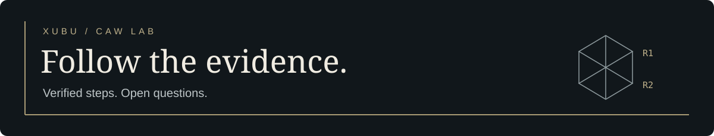

# CAW riddle research

Two on-chain trailheads. A record of what can be reproduced, and what remains open.

**[Read the trail](docs/VISUAL_GUIDE.md)** · **[Check the evidence](LAYER_INDEX.md)** · **[Replay the tablet](layers/R1-010_friderici_poem_coords/REPRODUCE.md)**

<table><tr><td width="34%">
<a href="docs/assets/r1-tablet.png"></a>
</td><td>
<h3>The first trailhead</h3>
<p><code>58bZfQ1</code> leads to this tablet image. Its RGB pixel bits yield 46 coordinates. A separate insertion in the final PNG checksum yields the mirror/backwards poem.</p>
<p>Both now reproduce from the preserved image. The public OCR book-cipher recipe now reproduces the historical IPFS identifier.</p>
<p><a href="layers/R1-010_friderici_poem_coords/REPRODUCE.md">Method, hashes and limits →</a></p>
</td></tr></table>

## A message recovered

The R2 hex now yields a complete message about building CAW. Every character survives an exact round trip. **[Read the message](layers/R2-020_hex_transposition/MESSAGE.md)** · **[How it was found and verified](docs/R2_RECOVERY_EXPOSE.md)** · [Replay the cipher](layers/R2-020_hex_transposition/REPRODUCE.md).

## Where we stand

| Trail | Reproduced | Still open |
| --- | --- | --- |
| **R1 · 58bZfQ1** | Tablet → clues → book-cipher CID; canonical audio → Enkidu → manifesto. | Live CID-to-audio custody and any further layer. |
| **R2 · zrUfKaKV** | Live hex → coherent message, with an exact inverse check. **Decoded layer verified.** | Any subsequent hidden layer or terminal answer. |

An archived claim is a lead. A replay is evidence. Neither alone proves the whole riddle is finished.

## Choose a route

- **New to the hunt:** [visual guide](docs/VISUAL_GUIDE.md) → [riddle progress](docs/RIDDLE_PROGRESS.md).
- **Checking a result:** [tablet replay](layers/R1-010_friderici_poem_coords/REPRODUCE.md) · [Enkidu replay](layers/R1-040_deepsound_enkidu/REPRODUCE.md).
- **Tracing the gaps:** [R1 narrative](docs/R1_58bZfQ1_END_TO_END.md) · [R2 status](docs/R2_zrUfKaKV_STATUS.md).
- **Checking provenance:** [on-chain receipts](docs/ONCHAIN_TRACE.md) · [what the facts prove](docs/WHAT_THE_FACTS_PROVE.md).
- **Reading XUBU:** [collected Medium articles](https://github.com/Xubu-Trad/xubu-medium). Historical writing is separate from verified riddle canon.

## Reproduce or contribute

```sh
python3 scripts/reproduce_tablet.py
python3 scripts/reproduce_enkidu.py
python3 scripts/reproduce_r2_transposition.py layers/R2-020_hex_transposition/EVIDENCE/zrUfKaKV.hex --out-dir replay-r2
bash scripts/check_canon.sh
```

For a proposed step, provide exact inputs, commands, output hashes and limits. Use the [layer template](layers/TEMPLATE/) and update the manifest. Public evidence excludes private correspondence, credentials and unsupported identity claims.

[Mission and acknowledgements](docs/PROJECT_BACKGROUND.md) · [Hunters](docs/HUNTERS.md) · [Privacy](docs/PUBLICATION_PRIVACY.md) · [Security](SECURITY.md) · [License](LICENSE)
