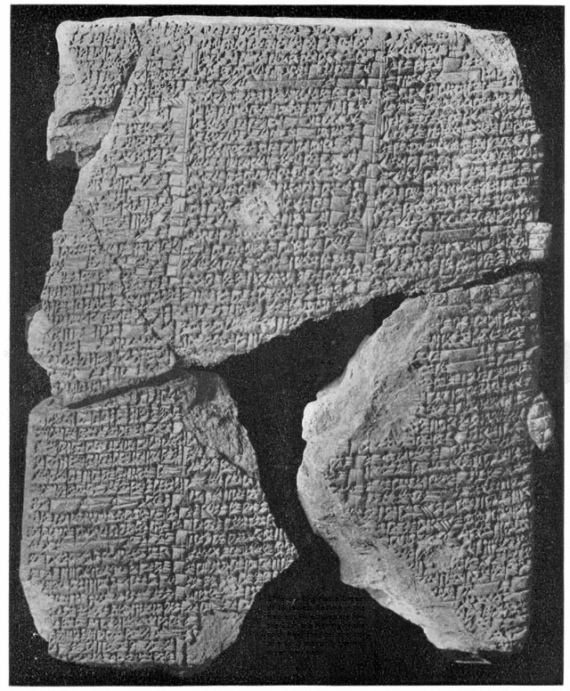
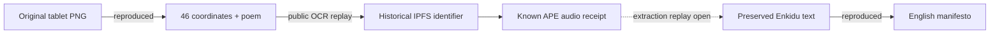

# Read the trail

**R1 starts with a picture. R2 starts with a short code.** Follow a link when you want the bytes behind the explanation.

## R1 · the image and the book

The image is preserved unchanged, including its unusual final checksum. A display copy or screenshot may lose the evidence. [Source and checksum](assets/IMAGE_SOURCES.md).

The solid historical CID-to-audio handoff has a preserved receipt; it is not a new live network retrieval. The dashed edge marks the remaining independent audio-extraction gap. [Replay the book cipher](../layers/R1-020_book_cipher_gilgamesh/REPRODUCE.md).

### What the image actually carries

| Evidence | Where it lives | Replay |
| --- | --- | --- |
| 46 line:word coordinates | Lowest bit of each R, G, B channel, read across rows and packed most-significant bit first | [Tablet replay](../layers/R1-010_friderici_poem_coords/REPRODUCE.md) |
| Mirror/backwards poem | ASCII hex inserted between the third and fourth bytes of the final PNG checksum | [Exact offsets](../layers/R1-010_friderici_poem_coords/EVIDENCE/tablet_replay.json) |
| Manifesto | A separate preserved Enkidu pseudohex input | [Text replay](../layers/R1-040_deepsound_enkidu/REPRODUCE.md) |

The poem and coordinates were already known. This update supplies an independent, exact replay from the image. It does not announce a new hidden layer.

## R2 · keep the input fixed

`zrUfKaKV` is the trailhead. A file that looks compressed, encrypted or audio-like still needs a complete parser or checksum validation. A short header match cannot carry that claim.

[R2 status and limits](R2_zrUfKaKV_STATUS.md) · [Full layer index](../LAYER_INDEX.md)

## Reading the archive

**Reproduced** means a bounded test ran and matched its receipt. **Historical** means the source reports it. **Open** means a necessary step is missing. Keep those labels intact when continuing the hunt.
